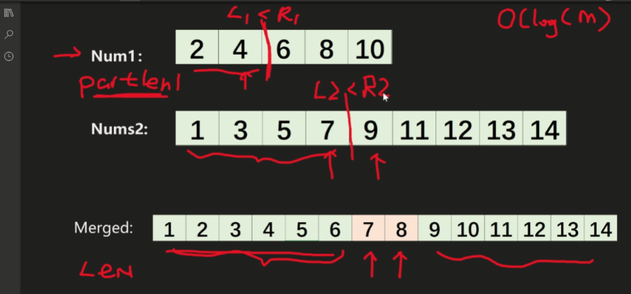

给定两个大小分别为 m 和 n 的正序（从小到大）数组 nums1 和 nums2。请你找出并返回这两个正序数组的 中位数 。

算法的时间复杂度应该为 O(log (m+n)) 。

```
输入：nums1 = [1,3], nums2 = [2]
输出：2.00000
解释：合并数组 = [1,2,3] ，中位数 2
```


```
输入：nums1 = [1,2], nums2 = [3,4]
输出：2.50000
解释：合并数组 = [1,2,3,4] ，中位数 (2 + 3) / 2 = 2.5
```



* 根据已知的长度 Len，求出 合适的 partLen1 
* 求出 L1 L2 左边分段中 L1 L2 中选择一个比较大的
* R1 R2 中选择一个 比较小的
* 通过 上面求到的值就能拿到中位数了

```js
var findMedianSortedArrays = function (nums1, nums2) {
    let len1 = nums1.length;
    let len2 = nums2.length;
    
    // 1 比较长的话 选 2
    if (len1 > len2) return findMedianSortedArrays(nums2, nums1);
    
    let len = len1 + len2; // 合并长度
    
    let start = 0, end = len1; // 定义指针
    
    let partLen1, partLen2; // 定义 第一部分的长度 和 第二部分长度
    
    while (start <= end) {
        partLen1 = (start + end) >> 1; // 取整
        partLen2 = ((len + 1) >> 1) - partLen1;
        
        let L1 = partLen1 === 0 ? -Infinity : nums1[partLen1 - 1];
        let L2 = partLen2 === 0 ? -Infinity : nums2[partLen2 - 1];
        let R1 = partLen1 === len1 ? Infinity : nums1[partLen1];
        let R2 = partLen2 === len2 ? Infinity : nums2[partLen2];
        
        if (L1 > R2) {
            end = partLen1 - 1;
        } else if (L2 > R1) {
            start = partLen1 + 1;
        } else {
            // 剩下情况满足条件 L1 <= R2 L2 <= R1
            return len % 2=== 0 ? (Math.max(L1, L2) + Math.min(R1, R2)) / 2 : Math.max(L1, L2);
        }
    }
}
```

```js
/**
 * @param {number[]} nums1
 * @param {number[]} nums2
 * @return {number}
 */
var findMedianSortedArrays = function(nums1, nums2) {
    // 数组排序合并
    const target = nums1.concat(nums2).sort((a, b) => a - b);
    
    // 双指针
    let left = 0;
    let right = 0;
    let queue = []
    
    for (let i = 0; i < target.length; i++) {
        if (left === right) {
            right++;
        } else {
            left++;
        }
        queue.push(target[i]);
    }
    
    return Math.floor((queue[left] + queue[right]) / 2);
};
```


