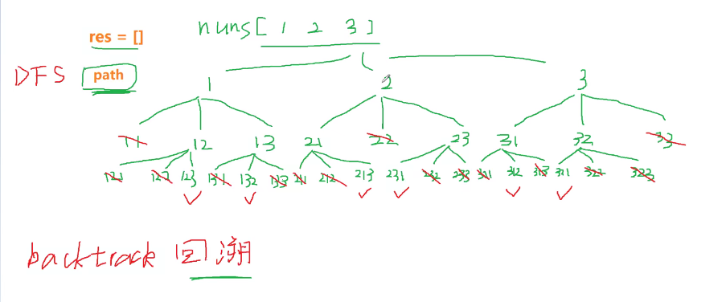

### 全排列



### 思路

* 全排列是树结构的完整展示，用一个队列来维护路径，深度优先遍历（dfs）
* 首先我们先确定递归的主体是什么，递归主体是整个数组每一项
* 时间和空间 O(n * n!) 指数级别
* 空间复杂度 O(n)

```js
var permute1 = function(nums) {
    let res = [];
    let len = nums.length;
    
    // 深度优先遍历
    var dfs = function (path) {
        // 递归出口
        if (path.length === len) {
            res.push([...path]);
            return;
        }
        // 遍历数组列表
        for (let i = 0; i < len; i++) {
            // 如果在路径中不存在 当前的nums 值的 话 加入路径
            if (path.includes(nums[i])) {
                continue;
            }
            
            path.push(nums[i]); // 存入到路径中
            dfs(path); // 递归直到路径完整了
            path.pop(); // 这一步很关键 回溯
        }
    }

    dfs([]); // 这里传入的空数组是路径

    return res;
}
```


### 优化版本

```js
/**
 * @param {number[]} nums
 * @return {number[][]}
 */

// 递归算法 深度优先遍历
// 回溯算法 dfs 算法
// 递归树木节点决定的
// 时间和空间 O(n * n!) 指数级别
var permute1 = function(nums) {
    let result = [];
    let len = nums.length;
    let queue = []; // 存放排列队列
    let isUse = []; // 判断是否已经使用过该节点
    if (!len) {return []}

    function dfs(nums, len, start, queue, isUse, result) {
        // 递归终止条件
        if (len === start) {
            result.push([...queue]);
            return;
        }
        for (let i = 0; i < len; i++) {
            if (isUse[i]) {
                continue
            }
            queue.push(nums[i]); //存入队列
            isUse[i] = true; // 判断已经存入队列的 数据
            dfs(nums, len, start + 1, queue, isUse, result); // 递归
            // 关键一步 回溯 将状态重置
            queue.pop();
            // 重置状态
            isUse[i] = false;
        }
    }
    dfs(nums, len, 0, queue, isUse, result);
    return result;
};
```

### 终极版本

* 交换两个数组中的值

```js
var permute1 = function(nums) {
    let res = [];
    let len = nums.length;
    let p = 0;
    let q = nums.length - 1;
    
    var swap = function (p, q) {
        if (p === q) return;
        return [nums[p], nums[q]] = [nums[p], nums[q]]; 
    }
    
    // 深度优先遍历
    var dfs = function (p, q) {
        // 递归出口
        if p === q) {
            res.push([...path]);
            return;
        }
        // 遍历数组列表
        for (let i = p; i <= q; i++) {
            swap(p, i);
            dfs(p + 1, q);
            swap(p, i);
        }
    }

    dfs(p, q); // 这里传入的空数组是路径

    return res;
}
```
