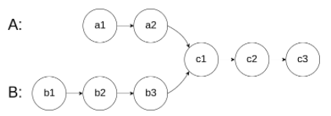

给你两个单链表的头节点 headA 和 headB ，请你找出并返回两个单链表相交的起始节点。如果两个链表不存在相交节点，返回 null 。

图示两个链表在节点 c1 开始相交：



题目数据 保证 整个链式结构中不存在环。

注意，函数返回结果后，链表必须 保持其原始结构 。


### 双指针

```js
/**
 * @param {ListNode} headA
 * @param {ListNode} headB
 * @return {ListNode}
 */
var getIntersectionNode = function(headA, headB) {
    let left = headA;
    let right = headB;
    while (left !== right) {
        if (left === null) {
            left = headB;
        } else {
            left = left.next;
        }
        if (right === null) {
            right = headA;
        } else {
            right = right.next;
        }
    }
    return left;
};
```

```js
/**
 * Definition for singly-linked list.
 * function ListNode(val) {
 *     this.val = val;
 *     this.next = null;
 * }
 */

/**
 * @param {ListNode} headA
 * @param {ListNode} headB
 * @return {ListNode}
 */
var getIntersectionNode = function(headA, headB) {
    let hash = new Set();
    
    let temp = headA;
    
    while (temp !== null) {
        hash.add(temp);
        temp = temp.next;
    }
    
    temp = headB;
    
    while (temp !== null) {
        if (hash.has(temp)) {
            return temp;
        }
        temp = temp.next;
    }
    
    return null;
};
```