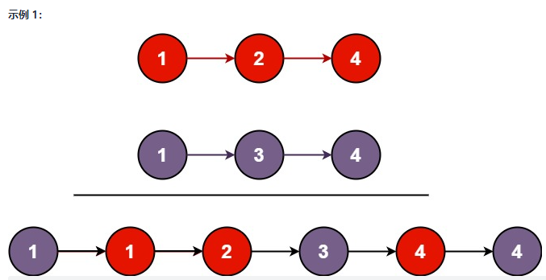

将两个升序链表合并为一个新的 升序 链表并返回。新链表是通过拼接给定的两个链表的所有节点组成的。 



```
输入：l1 = [1,2,4], l2 = [1,3,4]
输出：[1,1,2,3,4,4]
```

```
输入：l1 = [], l2 = []
输出：[]
```

```
输入：l1 = [], l2 = [0]
输出：[0]
```


```js
/**
 * Definition for singly-linked list.
 * function ListNode(val, next) {
 *     this.val = (val===undefined ? 0 : val)
 *     this.next = (next===undefined ? null : next)
 * }
 */
/**
 * @param {ListNode} list1
 * @param {ListNode} list2
 * @return {ListNode}
 */
var mergeTwoLists = function(list1, list2) {
    let list = new ListNode(0);
    let p = list;
    
    while (list1 !== null && list2 !== null) {
        if (list1.val > list2.val) {
            p.next = list2;
            list2 = list2.next;
        } else {
            p.next = list1;
            list1 = list1.next;
        }
        // 更新结果队列
        p = p.next;
    }

    if (list1 !== null) {
        p.next = list1;
    }
    if (list2 !== null) {
        p.next = list2;
    }
    
    return list.next;
};
```

### 递归实现

```js
/**
 * Definition for singly-linked list.
 * function ListNode(val) {
 *     this.val = val;
 *     this.next = null;
 * }
 */
/**
 * @param {ListNode} l1
 * @param {ListNode} l2
 * @return {ListNode}
 */

var mergeTwoLists = function(l1, l2) {
    if (l1 === null) {
        return l2;
    } else if (l2 === null) {
        return l1;
    } else if (l1.val < l2.val) {
        l1.next = mergeTwoLists(l1.next, l2);
        return l1;
    } else {
        l2.next = mergeTwoLists(l1, l2.next)
        return l2;
    }
};
```