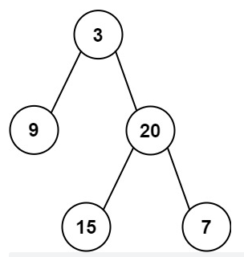

输入某二叉树的前序遍历和中序遍历的结果，请构建该二叉树并返回其根节点。

假设输入的前序遍历和中序遍历的结果中都不含重复的数字。

示例 1:



```
Input: preorder = [3,9,20,15,7], inorder = [9,3,15,20,7]
Output: [3,9,20,null,null,15,7]
```


示例 2:

```
Input: preorder = [-1], inorder = [-1]
Output: [-1]
```

* 先序 遍历一次 找到的是 第一个是根节点（假设它全部节点都不重复前提下）
* 根据节点 将中序遍历的队列分开成两个队列 左边是根节点左子树 右边是根节点的右子树
* 然后针对 两个队列左右比较 一个一个进行判断 递归判断

```js
/**
 * Definition for a binary tree node.
 * function TreeNode(val) {
 *     this.val = val;
 *     this.left = this.right = null;
 * }
 */
/**
 * @param {number[]} preorder
 * @param {number[]} inorder
 * @return {TreeNode}
 */
var buildTree = function(preorder, inorder) {
    // 两者任何一个为空将推出
    if (preorder.length === 0) return null;
    if (preorder === 1) return new TreeNode(preorder[0]);
    // 判断长度
    if (preorder.length !== inorder.length) {
        return null;
    }
    
    // 取出前序遍历 获取到的 根节点 root
    let rootVal = preorder[0];
    
    // 找到中序遍历中 根节点的位置 假设肯定存在不为空
    let position = inorder.indexOf(rootVal);
    
    // 找到左边的数组
    let inLeft = inorder.slice(0, position);
    // 找到右边的数组
    let inRight = inorder.slice(position + 1);
    
    let preLeft = preorder.slice(1, position + 1);
    let preRight = preorder.slice(position + 1);

    let rootNode = new TreeNode(rootVal);
    rootNode.left = buildTree(preLeft, inLeft);
    rootNode.right = buildTree(preRight, inRight);
    
    return rootNode;
};
```