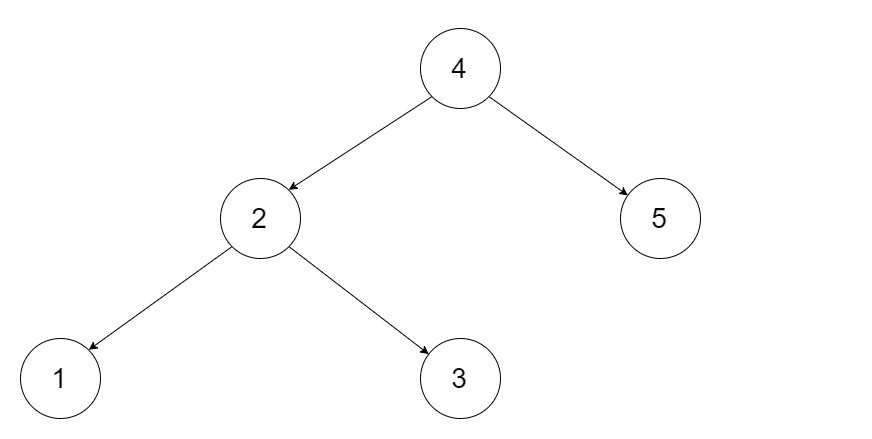
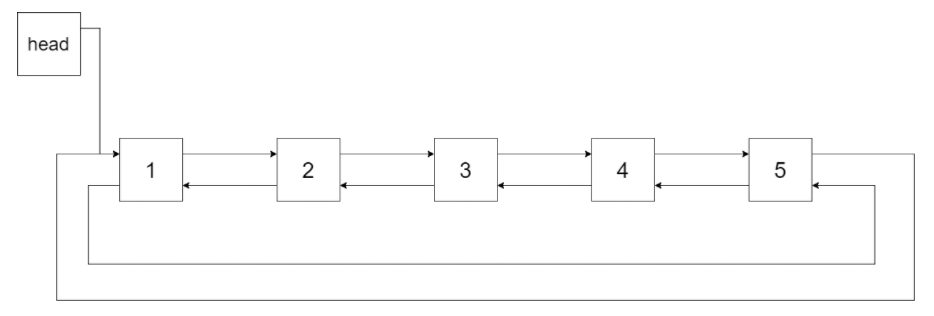

输入一棵二叉搜索树，将该二叉搜索树转换成一个排序的循环双向链表。要求不能创建任何新的节点，只能调整树中节点指针的指向。


为了让您更好地理解问题，以下面的二叉搜索树为例：




我们希望将这个二叉搜索树转化为双向循环链表。链表中的每个节点都有一个前驱和后继指针。对于双向循环链表，第一个节点的前驱是最后一个节点，最后一个节点的后继是第一个节点。

下图展示了上面的二叉搜索树转化成的链表。“head” 表示指向链表中有最小元素的节点。




特别地，我们希望可以就地完成转换操作。当转化完成以后，树中节点的左指针需要指向前驱，树中节点的右指针需要指向后继。还需要返回链表中的第一个节点的指针。

```js
/**
 * // Definition for a Node.
 * function Node(val,left,right) {
 *    this.val = val;
 *    this.left = left;
 *    this.right = right;
 * };
 */
/**
 * @param {Node} root
 * @return {Node}
 */
// 二叉搜索树转化为双向循环链表
// 这个二叉搜索树转化为双向循环链表。链表中的每个节点都有一个前驱和后继指针。对于双向循环链表，第一个节点的前驱是最后一个节点，最后一个节点的后继是第一个节点
// 双向链表 前驱和后继的概念 其实就是中序遍历+双向链表的操作
var treeToDoublyList = function(root) {
    if(!root){
        return null;
    }
    let pre = null;
    let head = null;
    dfs(root);
    // 这时候的pre不是null，而是末尾节点值
    pre.right = head;
    head.left = pre;
    return head;
    function dfs(root){
        if(!root) {
            return null;
        }
        // 中序遍历
        dfs(root.left);
        if(pre) {
            pre.right = root;
        } else {
            // 注意中序遍历 头结点不是该链表的第一个节点 比如[4,2,5,1,3] 肯定不是4
            // 这里确定头结点
            head = root;
        }
        root.left = pre;
        pre = root;
        dfs(root.right);
    }
};
```