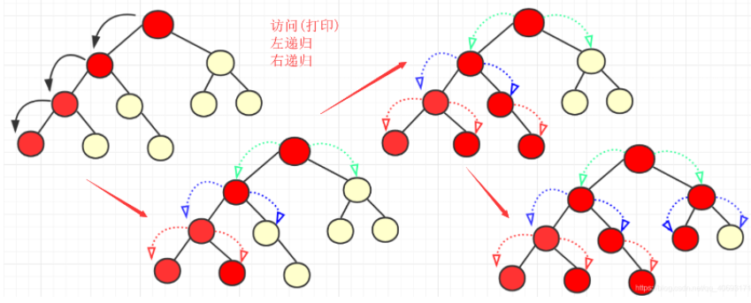
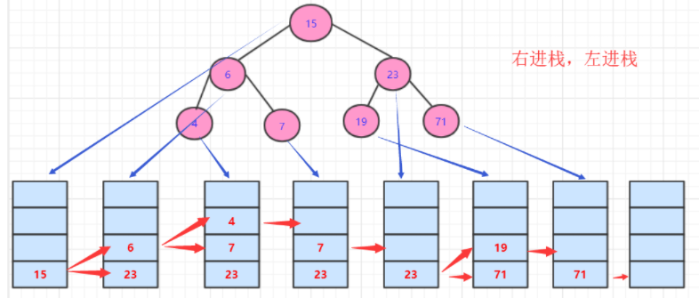

### 前序遍历

前序的规则就是根结点 ---> 左子树 ---> 右子树.我们在调用递归前进行节点操作。对于前序，就是先访问(输出)该节点。而递归左，递归右侧，会优先递归左侧。直到没有左节点。才会停止。访问次序大致为：

前序遍历也可以称为前序递归



```js
function dfs(node) {
    if (node !== null) {
        console.log(node.val)
    }
    // 优先遍历左节点 如果没有 再遍历右节点
    dfs(node.left);
    dfs(node.right);
}
```


### 利用栈的前序遍历



```js
function dps(node) {
    let queue = [];
    if (node == null) {
        return
    }
    if (node !== null) {
        queue.push(node)
    }
    
    // 队列反过来 右节点 先进 左节点后进
    while (queue.length > 0) {
        let t1 = queue.pop();
        if (t1.right != null) {
            queue.push(t1.right);
        }

        if (t1.left != null) {
            queue.push(t1.left);
        }
        
        console.log(t1.val)
    }
}
```

### 方法二

方法二和非递归中序遍历的方法类似，只不过需要修改输出时间，在进栈时候输入访问节点即可。


```js
function dfs(node) {
    let queue = [];
    
    while (queue.length > 0 || node !== null) {
        if (node !== null) {
            queue.push(node);
            node = node.left;
        } else {
            node = queue.pop();
            node = node.right;
        }
    }
}
```