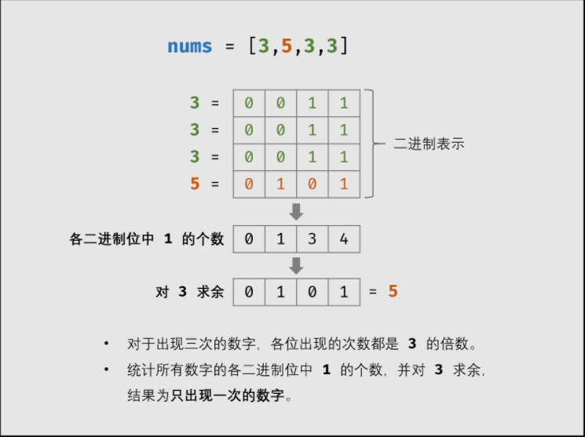

在一个数组 nums 中除一个数字只出现一次之外，其他数字都出现了三次。请找出那个只出现一次的数字。

示例 1：

```
输入：nums = [3,4,3,3]
输出：4
```

```
输入：nums = [9,1,7,9,7,9,7]
输出: 1
```

### 位运算
如下图所示，考虑数字的二进制形式，对于出现三次的数字，各 二进制位 出现的次数都是 33 的倍数。
因此，统计所有数字的各二进制位中 11 的出现次数，并对 33 求余，结果则为只出现一次的数字。




### 有限状态机

各二进制位的 位运算规则相同 ，因此只需考虑一位即可。
如下图所示，对于所有数字中的某二进制位 11 的个数，存在 3 种状态，
即对 3 余数为 0, 1, 20,1,2 。

* 若输入二进制位 11 ，则状态按照以下顺序转换
* 若输入二进制位 00 ，则状态不变。

接下来，需要通过 状态转换表 导出 状态转换的计算公式 。首先回忆一下位运算特点，对于任意二进制位 xx ，有：

* 异或运算：x ^ 0 = x​ ， x ^ 1 = ~x 
* 与运算：x & 0 = 0 ， x & 1 = x

```js
var singleNumer =function (nums) {
    let ones = 0, twos = 0;
    for(let num of nums){
        ones = ones ^ num & ~twos;
        twos = twos ^ num & ~ones;
    }
    return ones;
}
```

### 哈希表记录出现次数

```js
/**
 * @param {number[]} nums
 * @return {number}
 */
var singleNumber = function(nums) {
    if (!nums.length) return null;
    
    let hash = new Map();
    
    for (let i = nums.length - 1; i >= 0; i--) {
        if (hash.has(nums[i])) {
            hash.set(nums[i], hash.get(nums[i]) + 1)
        } else {
            hash.set(nums[i], 1)
        }
    }
    
    let ans = null;
    for (let item of hash) {
        if (item[1] === 1) {
            ans = item[0];
        }
    }
    return ans;
};
```