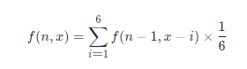
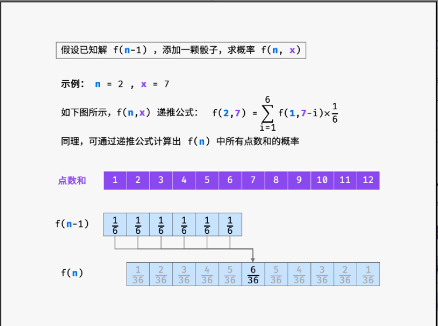
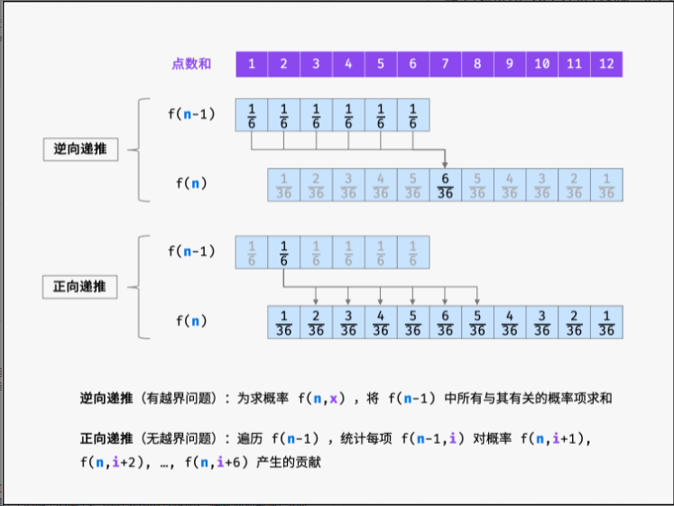

把n个骰子扔在地上，所有骰子朝上一面的点数之和为s。输入n，打印出s的所有可能的值出现的概率。


你需要用一个浮点数数组返回答案，其中第 i 个元素代表这 n 个骰子所能掷出的点数集合中第 i 小的那个的概率。

```
输入: 1
输出: [0.16667,0.16667,0.16667,0.16667,0.16667,0.16667]
```

```
输入: 2
输出: [0.02778,0.05556,0.08333,0.11111,0.13889,0.16667,0.13889,0.11111,0.08333,0.05556,0.02778]
```

### 思路

二层 DP

1. 骰子有 6个 面 摇到每个每个面的概率 是 1/6 Base DP
2. 当 骰子数量 等于 1 时候 直接 返回 dp 数组 Base DP 每个都是 1/6
3. 当 骰子增加一个，结果数组的长度增加 5个
   1. 假设增加骰子 前的 点数范围是 [a....b]
   2. 增加一个骰子以后，点数范围发生变化 [a+1,.... b+6], 范围增加了 5 （6-1）
4. 核心 遍历的是 n 骰子的数量  下标从2 开始，新建目标数组 tmp = [] 长度规律是 5 * 骰子长度 + 1
5. 遍历 长度 dp 数组

假设已知 n - 1n−1 个骰子的解 f(n - 1)f(n−1) ，此时添加一枚骰子，求 nn 个骰子的点数和为 xx 的概率 f(n, x)f(n,x) 。

当添加骰子的点数为 11 时，前 n - 1n−1 个骰子的点数和应为 x - 1x−1 ，方可组成点数和 xx ；同理，当此骰子为 22 时，前 n - 1n−1 个骰子应为 x - 2x−2 ；以此类推，直至此骰子点数为 66 。将这 66 种情况的概率相加，即可得到概率 f(n, x)f(n,x) 。递推公式如下所示：



根据以上分析，得知通过子问题的解 f(n - 1)f(n−1) 可递推计算出 f(n)f(n) ，而输入一个骰子的解 f(1)f(1) 已知，因此可通过解 f(1)f(1) 依次递推出任意解 f(n)f(n) 。



递推公式虽然可行，但 f(n - 1, x - i)f(n−1,x−i) 中的 x - ix−i 会有越界问题。例如，若希望递推计算 f(2, 2)f(2,2) ，由于一个骰子的点数和范围为 [1, 6][1,6] ，因此只应求和 f(1, 1)f(1,1) ，即 f(1, 0)f(1,0) , f(1, -1)f(1,−1) , ... , f(1, -4)f(1,−4) 皆无意义。此越界问题导致代码编写的难度提升。



```js
/**
 * @param {number} n
 * @return {number[]}
 */
var dicesProbability = function(n) {
    let dp = Array(6).fill(1/6);
    
    for(let i = 2; i <= n; i++) {
        let tmp = Array(5 * i + 1).fill(0); // 2 -> 11
        for (let j = 0; j < dp.length; j++) {
            for (let k = 0; k < 6; k++) {
                tmp[j+k] += dp[j] / 6; // 状态转移
            }
        }
        dp = tmp;
    }
    return dp;
};
```