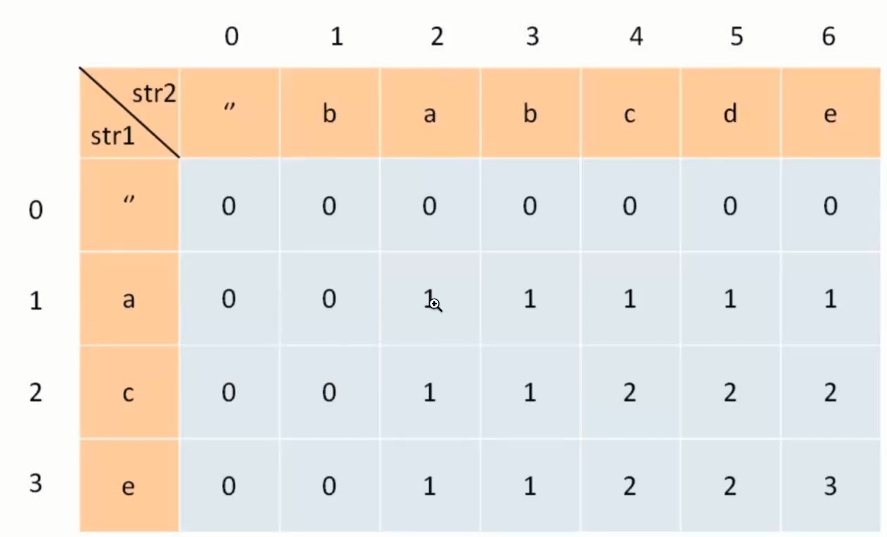

## 最长公共子序列

给定两个字符串 text1 和 text2，返回这两个字符串的最长 公共子序列 的长度。如果不存在 公共子序列 ，返回 0 。

一个字符串的 子序列 是指这样一个新的字符串：
它是由原字符串在不改变字符的相对顺序的情况下删除某些字符（也可以不删除任何字符）后组成的新字符串。

例如，"ace" 是 "abcde" 的子序列，但 "aec" 不是 "abcde" 的子序列。
两个字符串的 公共子序列 是这两个字符串所共同拥有的子序列。

```
输入：text1 = "abcde", text2 = "ace" 
输出：3  
解释：最长公共子序列是 "ace" ，它的长度为 3 。
```


```
输入：text1 = "abc", text2 = "abc"
输出：3
解释：最长公共子序列是 "abc" ，它的长度为 3 。
```


```
输入：text1 = "abc", text2 = "def"
输出：0
解释：两个字符串没有公共子序列，返回 0 。
```





### 题目介绍

LCS 

1. 明确dp数组含义
遇到子序列的题目，直接 上 dp
dp[i][j] 含义 对于 s1[1...i]和s2[1....j]  lcs最长 d[i][j]

dp[2][4] 含义 ac 和 babc 最长是 2

2. 定义base case

dp[i][0] 和 dp[0][j] = 0

3. 确定方程（状态转义方程）
   1. lcs 中
   2. 不在lcs 中

4. 如果某个字符存在于 lcs中 那么这个字符一定同事存在于 s1 和 s2 中
5. 构建 dp 表的值是 我们求的答案，从左到右遍历，保证左边和上面的数值已经被计算过
6. 做决策 
   1. 状态转移方程 s1[i] === s2[j] 那么这个字符一定存在于 lcs中 直接 +1
   2. 如果 s1[i] !== s2[j] 那么至少s1[i] s2[j]有一个字符不存在 lcs中，所以要从两个中取一个最大值
   3. Math.max(dp[i-1][j], dp[i][j-1])

```js
/**
 * @param {string} text1
 * @param {string} text2
 * @return {number}
 */
var longestCommonSubsequence = function(text1, text2) {
    const n = text1.length;
    const m = text2.length;
    // // 二维数组
    const dp = Array.from(new Array(n + 1), () => new Array(m + 1).fill(0));
    for (let i = 1; i <= n; i++) {
        for (let j = 1; j <= m; j++) {
            if (text1[i - 1] === text2[j -1]) {
                dp[i][j] = dp[i - 1][j - 1] + 1;
            } else {
               dp[i][j] = Math.max(dp[i-1][j], dp[i][j-1]);
            }
        }
    }
    
    return dp[n][m];
};
```

### 总结

涉及到两个字符串或者数组的时候，dp数组含义一般都是差不多
子数组 arr1[0...i] 和 arr2[0....j]