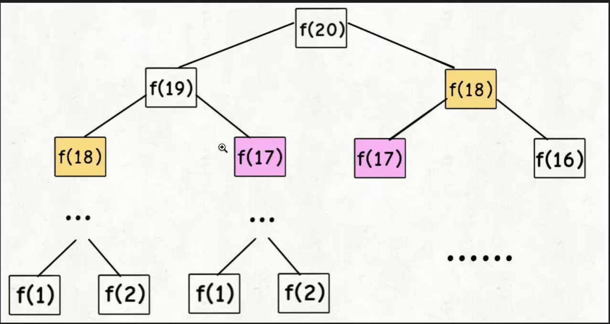

写一个函数，输入 n ，求斐波那契（Fibonacci）数列的第 n 项（即 F(N)）。斐波那契数列的定义如下：

```
F(0) = 0,   F(1) = 1
F(N) = F(N - 1) + F(N - 2), 其中 N > 1.
```

斐波那契数列由 0 和 1 开始，之后的斐波那契数就是由之前的两数相加而得出。

答案需要取模 1e9+7（1000000007），如计算初始结果为：1000000008，请返回 1。

```
输入：n = 2
输出：1
```

```
输入：n = 5
输出：5
```



### 递归实现

1. 时间复杂度 2^n 
2. 空间复杂度 

```js
/**
 * @param {number} n
 * @return {number}
 */
function fib(n) {
    if (n === 0) {
        return 0;
    }
    if (n === 1 || n === 2) {
        return 1
    }
    return fib(n-1) + fib(n-2)
}
```


### 记忆化搜索

备忘录, 用一个数组来记录已经计算出来的结果，用空间换时间

自顶向下的 n = 20 , 19 ,18, 17 ....
而dp 一般是自底向上的，f(1),f2,

* 时间复杂度 O(n)
* 

```js
function fib(n) {
    if (n === 0) {
        return 0;
    }
    let memoryArray = new Array(n + 1).fill(0);
    return fibHelper(memoryArray, n);
}

/**
 * 内存数组
 * @param memoArray
 * @param n
 */
function fibHelper(memoArray, n) {
    if (n === 1 || n === 2) {
        return 1;
    }
    if (!memoArray[n]) {
        memoArray[n] = fibHelper(memoArray, n - 1) + fibHelper(memoArray, n - 2);
    }
    return memoArray[n];
}
```

### dp
迭代的方法,自底向上

* 时间复杂度 O(n)

```js
function fib(n) {
    if (n === 0) {
        return 0;
    }
    
    let dp = new Array(n + 1).fill(0);
    dp[0] = 0;
    dp[1] = dp[2] = 1;
    
    for(let i = 3; i <= n; i++) {
        dp[i] = dp[i - 1] + dp[i - 2];
    }
    
    return dp[n];
}
```


### 状态压缩
自顶向下

```js
var fib = function(n) {
    let n1 = 0, n2 = 1, sum;
    for(let i = 0; i < n; i++){
        sum = (n1 + n2) % 1000000007;
        n1 = n2;
        n2 = sum;
    }
    return n1;
};
```