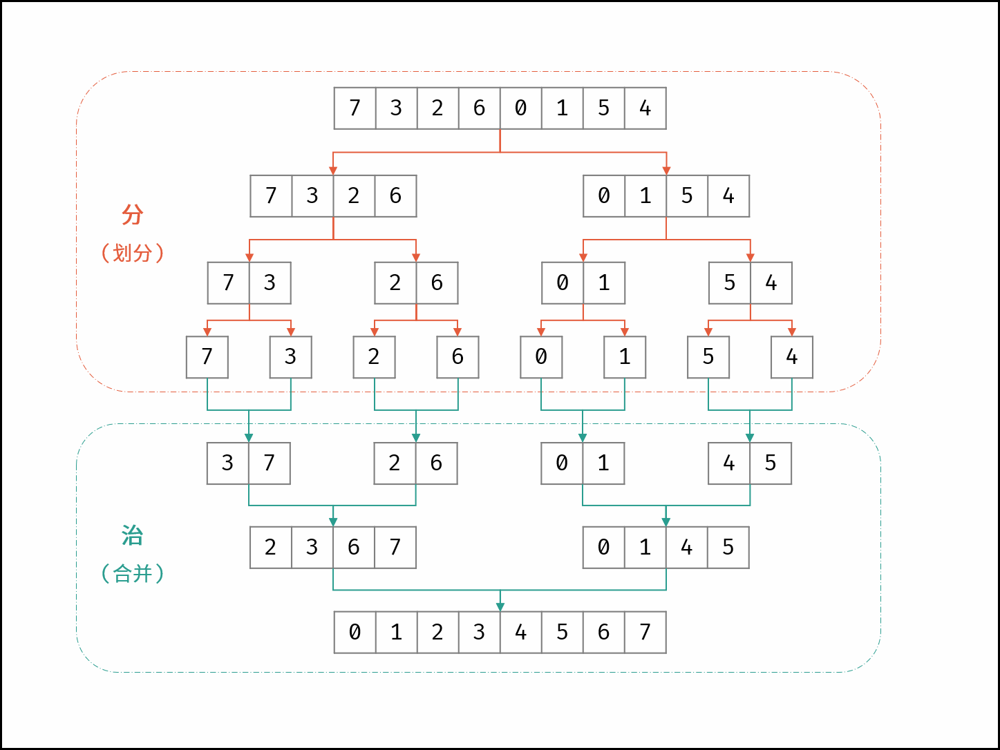

本科普是参考自 K神归并排序的参考 [归并排序](https://leetcode-cn.com/problems/shu-zu-zhong-de-ni-xu-dui-lcof/solution/jian-zhi-offer-51-shu-zu-zhong-de-ni-xu-pvn2h/)

归并排序是属于 分治的算法思想。

* 分 不断将数组从中点位置划分开（即二分法），将整个数组的排序问题转化为子数组的排序问题；
* 治 划分到子数组长度为 1 时，开始向上合并，不断将 较短排序数组 合并为 较长排序数组，直至合并至原数组时完成排序；

> 如下图所示，为数组 [7, 3, 2, 6, 0, 1, 5, 4][7,3,2,6,0,1,5,4] 的归并排序过程。

合并阶段 本质上是 合并两个排序数组 的过程，而每当遇到 左子数组当前元素 > 右子数组当前元素 时，意味着 「左子数组当前元素 至 末尾元素」 与 「右子数组当前元素」 构成了若干 「逆序对」 。

因此，考虑在归并排序的合并阶段统计「逆序对」数量，完成归并排序时，也随之完成所有逆序对的统计。

所以本质归并排序 是完成了逆序的数据统计

