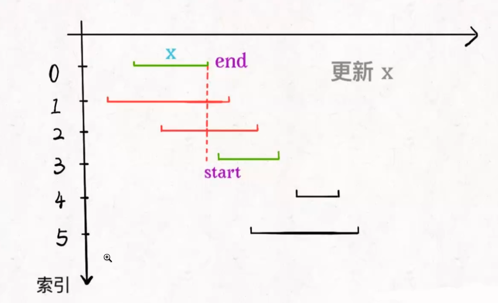

### 贪心算法

可以理解成 dp 的一种特殊情况，还需要满足贪心选择

贪心选择性质 每一步做出一个局部最优的选择，那么最终的就是全局最优

### 区间调度问题

有很多 [start, end] 请设计一个算法 算出这些区间，最多有几个互不相交的区间

```js
function fn(intvs: numbers[]) {}

// intvs = [[1,3], [2,4], [4,6]]

// [1,3] [4,6] 输出 2
```

### 贪心求解

### 正确思路

1. 选择最小的区间 x
2. 把所有的与 x 相交的区间 all 中剔除掉
3. 重复1，2步骤 直到 all 为空，之前选出的各种区间，就是我们想要的结果




```js
function intervalSchedule(intvs) {
    if (intvs.length === 0) return 0;
    let count = 1
    // 找到最小的区间x
    let sortArr = intvs.sort((a,b) => a[1] - b[1]);
    let endX = sortArr[0][1];
    
    // 所有 与 x 相交的区间 都要剔除掉
    for (let item of intvs) {
        const start = item[0]
        
        if (start >= endX) {
            count++;
            endX = item[1];
        }
    }
    
    return count;
}
```