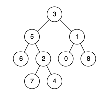

给定一个二叉搜索树, 找到该树中两个指定节点的最近公共祖先。

百度百科中最近公共祖先的定义为：“对于有根树 T 的两个结点 p、q，最近公共祖先表示为一个结点 x，满足 x 是 p、q 的祖先且 x 的深度尽可能大（一个节点也可以是它自己的祖先）。”

例如，给定如下二叉搜索树: root = [6,2,8,0,4,7,9,null,null,3,5]



示例 1:

```
输入: root = [6,2,8,0,4,7,9,null,null,3,5], p = 2, q = 8
输出: 6 
解释: 节点 2 和节点 8 的最近公共祖先是 6。
```

示例 2:

```
输入: root = [6,2,8,0,4,7,9,null,null,3,5], p = 2, q = 4
输出: 2
解释: 节点 2 和节点 4 的最近公共祖先是 2, 因为根据定义最近公共祖先节点可以为节点本身。
```

### 公共路径遍历法

* p 节点路径 3 -> 5 -> 6
* q 节点路径 3 -> 5 -> 2 -> 4
* 3, 5 都是祖先节点
* 最近的是的是最后一个相同的节点


### 如果获取路径

```js
var lowestCommonAncestor = function (root, p, q) {
    let path_p = getPath(root, p);
    let path_q = getPath(root, q);
    
    let ans = null;
    for (let i = 0; i < path_p.length; i++) {
        if (path_p[i] === path_q[i]) {
            ans = path_p[i]
        } else {
            continue
        }
    }
    return ans
}

// 获取路径的
var getPath = function (root, target) {
    let path = [];
    let node = root;
    
    while (node !== target) {
        // 前序遍历 入栈
        path.push(node);
        if (target.val < node.val) {
            node = node.left;
        } else {
            node = node.right;
        }
    }
    
    path.push(node);
    
    return path;
}
```