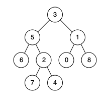

给定一个二叉树, 找到该树中两个指定节点的最近公共祖先。

百度百科

中最近公共祖先的定义为：“对于有根树 T 的两个结点 p、q，最近公共祖先表示为一个结点 x，满足 x 是 p、q 的祖先且 x 的深度尽可能大（一个节点也可以是它自己的祖先）。”

例如，给定如下二叉树: root = [3,5,1,6,2,0,8,null,null,7,4]



示例 1:

```
输入: root = [3,5,1,6,2,0,8,null,null,7,4], p = 5, q = 1
输出: 3
解释: 节点 5 和节点 1 的最近公共祖先是节点 3。
```

示例 2:

```
输入: root = [3,5,1,6,2,0,8,null,null,7,4], p = 5, q = 4
输出: 5
解释: 节点 5 和节点 4 的最近公共祖先是节点 5。因为根据定义最近公共祖先节点可以为节点本身。
```

### 递归解法

* 定义子问题 左右字数分别包括 p q
* 递归去找 左子树或者右子树 都存在 p 和 q

```js
/**
 * Definition for a binary tree node.
 * function TreeNode(val) {
 *     this.val = val;
 *     this.left = this.right = null;
 * }
 */
/**
 * @param {TreeNode} root
 * @param {TreeNode} p
 * @param {TreeNode} q
 * @return {TreeNode}
 */
var lowestCommonAncestor = function(root, p, q) {
    let ans = null;
    
    var dfs = function (root, p, q) {
        if (root === null) {
            return root;
        }
        let leftSon = dfs(root.left, p, q);
        let rightSon = dfs(root.right, p, q);
        if ((leftSon && rightSon) || ((root.val === p.val) || (root.val === q.val)) && (leftSon || rightSon)) {
            ans = root;
        }
        return leftSon || rightSon || (root.val === p.val || root.val === q.val);
    }

    dfs(root, p, q)
    return ans;
};
```


### 存储父节点

* 向上访问 直到出现交集节点
* 模式识别 判断是否出现过或者设计出现次数的问题，存在哈希里面


```js
var lowestCommonAncestor = function(root, p, q) {
    let fatherMap = new Map();
    let parents = new Map();
    
    var dfs = function (root) {
        if (root.left !== null) {
            fatherMap.set(root.left.val, root);
            dfs(root.left)
        }
        if (root.right !== null) {
            fatherMap.set(root.right.val, root);
            dfs(root.right)
        }
    }
    fatherMap[root] = null;
    
    dfs(root);
    
    while (p !== null) {
        parents.set(p, true);
        p = fatherMap.get(p);
    }

    while (q !== null) {
        if (parents.has(q)) {
            return q;
        }
        q = fatherMap.get(q);
    }
    return null;
};
```